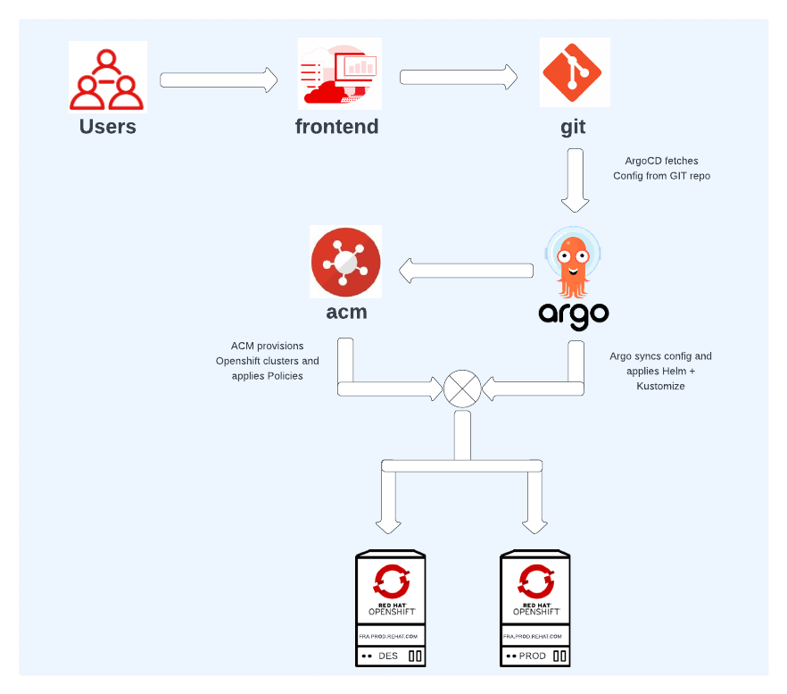
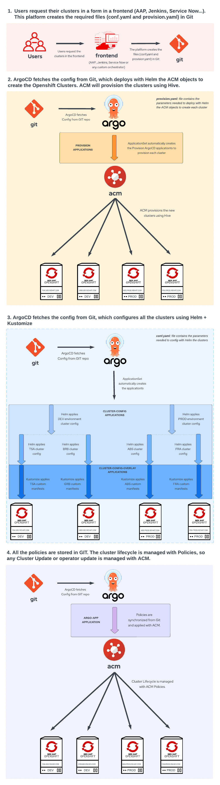

# GitOps for organizations: provisioning and configuring Openshift clusters automatically

When the organizations started to adopt Kubernetes platforms, like Openhsift, many years ago,  the most common scenario was a single cluster for all the workloads. However, as the rate of Openshift adoption got faster inside the organizations, more clusters were needed. And each organization started to work on its own automation: some of them used Ansible for the provisioning, others Terraform. Some of them used Ansible for the Day2 configuration and Cluster Life Cycle, others used GitOps tools like ArgoCD or Drone. Implementing the whole workflow of provisioning, day 2 configuration and Cluster Life Cycle in an automated way is not a simple task, and as there are no standards, each team defines its own solution.

In this article, I’ll not just describe how to create the whole workflow of Provisioning, Day 2 configuration and Cluster Lifecycle; but I’ll do it from an enterprise perspective. And this is the most important part of this article: I’m not using any cool custom plugin, or an amazing tool just found in github. Don’t get me wrong, I love to try new tools, but organizations require tools which are supported, used by other companies, coming from a reliable source.

## Overview

“Gitops for organizations” is a solution for provisioning and configuring Openshift clusters using Red Hat products (ACM and Openshift Gitops), allowing the use of any orchestrator (AAP/Tower, Service Now, Jenkins…). In this solution, Git is the central integration point and the source of truth. ACM will be used for provisioning and applying policies, and Openshift Gitops (ArgoCD) as Continuous Delivery tool for applying all the configuration to each Openshift cluster.

## How it works

The users fill in a form in a frontend (web application) to request a cluster, which is automatically provisioned and configured by ACM. This frontend can be any web application with a form, to fill in the cluster details, and able to push in a git repository the required yaml objects. This can be an AAP (Tower), Jenkins, or even ACM can be used. However, in my experience, most organizations prefer to have their own custom platform, like a “Marketplace”.

Once the form is filled with all the cluster parameters, files are generated and written to a git repository, which is automatically synchronized to ACM with ArgoCD. On one side, ACM will provision the cluster. On the other side, the ArgoCD ApplicationSet will create an Application to synchronize all the configuration for the new cluster. 

When the cluster is created, it’s automatically imported into ACM and added to Openshift Gitops. At this point, ArgoCD synchronizes all the configuration to the new cluster.

This solution is explained in more detail in these 2 parts:

* Part I: [Provisioning Openshift clusters using GitOps with ACM](docs/Part-1.md)
* Part II: [Configuring Openshift cluster with ApplicationSets using Helm+Kustomize and ACM Policies](docs/Part-2.md)

The repository used for the solution demonstration purposes is: [Gitops for Organizations](https://github.com/albertogd/gitops-for-organizations)

### Tools

#### Frontend
Web application with a form to fill in the cluster details. This can be AAP (Tower), Service Now, Jenkins or any custom web application. All the cluster parameters must be written in a yaml/json file and pushed to Git.

#### Red Hat Advanced Cluster Management for Kubernetes (RHACM)
ACM is used for provisioning Openshift clusters and also for applying policies to the clusters.

#### Openshift GitOps (ArgoCD)
Openshift GitOps (ArgoCD) is used as a Continuous Delivery tool for applying all the configuration to all out Openshift clusters.

