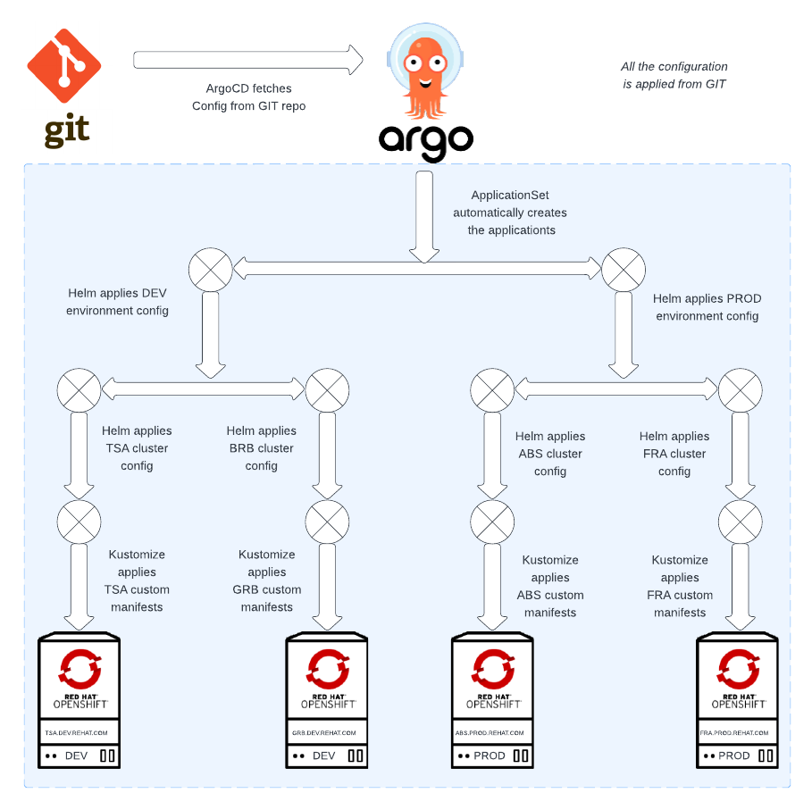

# GitOps for organizations - Part II: Configuring Openshift cluster with ApplicationSets using Helm+Kustomize and ACM Policies

There are multiple articles about GitOps describing how to use ArgoCD with Kustomize to configure multiple clusters or environments. They show a nice way to apply some kustomizations, but when you try you implement it in your organization, you’ll probably face the following “How can I” challenges:

* Dynamically add new clusters?
* Use templating (replace vars) in an easy way?
* Add any custom configuration to any of the clusters?  
* Specify the configuration I want to add to each cluster?  

Maybe you also read a cool post about creating a kustomize plugin. But organizations don’t want to rely on a custom plugin which is not supported. And the answer to all these questions is a really nice combination: ApplicationSets + Helm + Kustomize. 



The big picture of this solution is:

* Create an ApplicationSet which auto generates Helm Applications to configure the clusters
  * Leverage Helm templating to define all the configuration templates
  * Define conditional blocks in each template to control what templates can be included in which cluster
* Create an ApplicationSet which auto generate kustomize Applications to add any overlay
  * Patch, add other configurations using kustomize

> **Note**
> Creating only an ApplicationSet with a plugin of kustomize+Helm can be an alternative solution, however it’d duplicate the same kustomization overlay to all the Cluster applications. So it’s better to have an ApplicationSet for all the configurations based on templates, and an ApplicationSet for the kustomization for each cluster. 


## Cluster-config ApplicationSet

With an ApplicationSet, we can automate the generation of Argo CD Applications, which will be the placeholders for each of our cluster configurations. 

This is the ApplicationSet we’ll use in this solution to configure the clusters using Helm templates:

```yaml
apiVersion: argoproj.io/v1alpha1
kind: ApplicationSet
metadata:
 name: cluster-config
 namespace: openshift-gitops
spec:
 generators:
   - matrix:
       generators:
         - git:
             repoURL: https://github.com/albertogd/gitops-for-organizations.git
             revision: main
             files:
               - path: "clusters/**/conf.yaml"
         - list:
             elements:
               - template: openshift-machine-config
               - template: openshift-ingress
               - template: openshift-marketplace
 template:
   metadata:
     name: "config-{{cluster.environment}}-{{cluster.name}}-{{template}}"
     labels:
       environment: "{{cluster.environment}}"
       cluster: "{{cluster.fqdn}}"
       region: "{{cluster.region}}"
       cloud: "{{cluster.cloud}}"
   spec:
     project: default
     source:
       repoURL: https://github.com/albertogd/gitops-for-organizations.git
       targetRevision: main
       path: base/config/{{template}}
       helm:
         valueFiles:
           - /conf/{{cluster.environment}}/conf.yaml
           - /clusters/{{cluster.environment}}/{{cluster.fqdn}}/conf.yaml
     destination:
       server: "{{cluster.address}}"
     syncPolicy: {}
```

### Generator

There are several generators, but we’ll use a combination of 2 generators to show the power and flexibility of applicationset generators: git and list.

* With the **git generator**, we get all the conf.yaml objects. Each of them defines a cluster.
* With the **list generator**, we define all the argo Applications we have for each cluster. Each configuration type will become an Application.

With the **matrix generator**, we create all the list elements for each cluster. For example, for the cluster  salamanca.pre.redhat.com, we’ll have 3 Argo Applications:

* openshift-machine-config application for the cluster 
* openshift-ingress application for the cluster 
* openshift-marketplace application for the cluster  

### Template

In the template section, we define the Applications that will be created by the ApplicationSet:

* metadata:
  * name:  ArgoCD Application name `config-{{cluster.environment}}-{{cluster.name}} -{{template}}`
* spec:
  * source:
    * path: Helm chart path `base/config/{{template}}`
    * helm: type of the application
      * valueFiles: configuration files with the parameters of the cluster
        * `/conf/{{cluster.environment}}/conf.yaml`
        * `/clusters/{{cluster.environment}}/{{cluster.fqdn}}/conf.yaml`
    * repoURL: URL of the git repository
  * destination:
    * server: the API address of the cluster `{{cluster.address}}`

## Cluster-config-overlay ApplicationSet

This is the ApplicationSet we’ll use in this solution to apply the overlay configuration (all the configuration not based on templates) using kustomize:

```yaml
apiVersion: argoproj.io/v1alpha1
kind: ApplicationSet
metadata:
 name: cluster-config-overlays
 namespace: openshift-gitops
spec:
 generators:
 - git:
     repoURL: https://github.com/albertogd/gitops-for-organizations.git
     revision: main
     files:
       - path: "clusters/**/conf.yaml"
 template:
   metadata:
     name: "config-{{cluster.environment}}-{{cluster.name}}-overlay"
     labels:
       environment: "{{cluster.environment}}"
       cluster: "{{cluster.fqdn}}"
       region: "{{cluster.region}}"
       cloud: "{{cluster.cloud}}"
   spec:
     project: default
     source:
       repoURL: https://github.com/albertogd/gitops-for-organizations.git
       targetRevision: main
       path: clusters/{{cluster.environment}}/{{cluster.fqdn}}/overlay
     destination:
       server: "{{cluster.address}}"
     syncPolicy: {}
```

### Generator

With the **git generator**, we get all the conf.yaml objects. Each of them defines an Application for each cluster.

### Template

In the template we define the Applications that will be created by the ApplicationSet:

* metadata:
  * name: ArgoCD Application name `config-{{cluster.environment}}-{{cluster.name}}-overlay`
* spec:
  * source:
    * path: cluster overlay path `clusters/{{cluster.environment}}/{{cluster.fqdn}}/overlay`
    * repoURL: URL of the git repository
  * destination:
    + server: the API address of the cluster `{{cluster.address}}`

## Git repository structure

There are 3 main directories:

* **base**: all the Helm templates are stored in this directory. It has two subfolders:
  * config: we create a directory for each Chart (ArgoCD Application). In the example, we have the machine-config, oauth and 
  * **provision**: we have one openshift-provisioning application. This application is the one defined in the first part of provisioning Openshift clusters.
* clusters: the orchestrator, defined in the first part, will write the objects conf.yaml and provision.yaml in the subdirectory <clustername> . For the acm-hub, we’ll keep the configuration of the own ACM cluster:
  * applications: app-argocd, the initial argo, to synchronize all the cluster configuration
  * applicationsets: 3 applicationsets
    * cluster-config-overlays
    * cluster-config
    * cluster-provisioning
  * argocd: ArgoCD instance
  * gitops-cluster: objects to register ManagedClusters in ArgoCD
  * policies: policies used to configure the ManagedClusters
* **conf**: here we’ll keep the default values (conf.yaml and provision.yaml) for each environment (dev, pre and pro). In each environment there are 2 files: conf.yaml and provision.yaml

```
├── base
│   ├── config
│   |   ├── openshift-ingress
│   |   |   ├── Chart.yml
│   |   |   └── templates
│   |   |       ├── ingress.yml
│   |   |       └── service.yml
│   |   ├── openshift-machine-config
│   |   |   ├── Chart.yml
│   |   |   └── templates
│   |   |       ├── 05-worker-kernelarg-selinuxpermissive.yaml
│   |   |       └── master-kubeletconfig.yaml
│   |   └── openshift-marketplace
│   |       ├── Chart.yml
│   |       └── templates
│   |           ├── local-certified-operators.yml
│   |           └── local-community-operators.yml
│   └── provision
│       └── openshift-provisioning
│           ├── Chart.yml
│           └── templates
│               ├── clusterdeployment.yaml
│               ├── klusteraddonconfig.yaml
│               ├── machinepool.yaml
│               ├── managedcluster.yaml
│               ├── managedclusterinfo.yaml
│               └── namespace.yaml
├── clusters
│   ├── acm-hub
│   │   ├── applications
│   |   |   ├── app-argocd.yaml
│   |   |   └── kustomization.yml
│   │   ├── applicationsets
│   |   |   ├── cluster-config-overlays.yaml
│   |   |   ├── cluster-config.yaml
│   |   |   ├── cluster-provisioning.yaml
│   |   |   └── kustomization.yaml
│   │   ├── argocd
│   |   |   ├── argocd.yaml
│   |   |   └── kustomization.yaml
│   │   ├── gitops-cluster
│   |   |   ├── GitOpsCluster.yaml
│   |   |   ├── ManagedClusterSetBinding.yaml
│   |   |   ├── Placement.yaml
│   |   |   └── kustomization.yaml
│   │   └── policies
│   |       └── 4.11
│   │           ├── odf-operator
│   │           |   ├── binding-odf-operator-411.yaml
│   │           |   ├── kustomization.yaml
│   │           |   ├── placement-odf-operator-411.yaml
│   │           |   └── policy-odf-operator-411.yaml
│   │           └── upgrade-ocp
│   │               ├── binding-upgrade-cluster-411.yaml
│   │               ├── kustomization.yaml
│   │               ├── placement-upgrade-cluster-411.yaml
│   │               └── policy-upgrade-cluster-411.yaml
│   ├── dev
│   │   └── zamora.dev.redhat.com
│   |       ├──  provision.json
│   |       ├──  conf.yml
│   |       ├──  kustomization.yml
│   |       └──  overlay
│   |            ├── kustomization.yml
│   |            └── project.yml
│   └── pre
│       └── salamanca.pre.redhat.com
│           ├──  provision.json
│           ├──  conf.yml
│           ├──  kustomization.yml
│           └──  overlay
│                ├── kustomization.yml
│                └── project.yml
│   
└── conf
    ├── dev
    │   ├── conf.yaml
    │   └── provision.yaml
    ├── pre
    │   ├── conf.yaml
    │   └── provision.yaml
    └── pro
        ├── conf.yaml
        └── provision.yaml
```

In the directory clusters/acm-hub, we define the own objects of the ACM Hub:

* **applications**:
  * app-argocd.yaml: ArgoCD initial application to synchronize all
* **applicationsets**:
  * cluster-config-overlays.yaml: cluster-config ApplicationSet for kustomize applications 
  * cluster-config.yaml:  cluster-config ApplicationSet for Helm applications
  * cluster-provisioning.yaml: cluster-provisioning ApplicationSet for ACM cluster provisioning
* **argocd**
  * app-argocd.yml: the instance of ArgoCD
* **gitops-cluster**
  * GitOpsCluster.yaml: GitOpsCluster object to register the ManagedClusters to ArgoCD
  * ManagedClusterSetBinding.yaml: Binding for the ClusterSet
  * Placement.yaml: Placement to select ManagedClusters

## Initial application

There are multiple ways of bootstrapping all the configuration: using a policy, creating an Argo Application… If we have another cluster with ArgoCD, we can synchronize all the configurations from there using Openshift GitOps. However, we’re considering in this solution that we’re starting from 0, and we have only the ACM hub cluster. In this case, we need to create the initial application manually. After this, this initial application will be synchronized with ArgoCD

```bash
$ oc apply -f clusters/acm-hub/applications/app-argocd.yaml
```

## Why 2 ApplicationSets instead of using a custom plugin of Helm + Kustomize

Before explaining about Helm + Kustomize, let’s start with the feature we want:

* Base manifest templates:
  * Common manifest to apply to all the clusters (i.e. machine-config template)
  * Be able to include/exclude any base manifest (i.e. exclude oauth template)
* Custom manifests per cluster:
  * Be able to add any custom manifest to a specific cluster (i.e. add an Ingress) 
* Default values per environment:
  * Have a default configuration file per environment (i.e. development configuration)
* Custom values per cluster
  * Have a custom configuration file per cluster
* Avoid any custom/unsupported plugin

With Kustomize, it’s really easy to add kustom manifests, but it’s a tool for templating. Yes, you can add a Kustomize plugin to do the templating. But let’s not forget, this is about “GitOps for organizations”, and we want something OOB supported. And kustomize is not a templating tool OOB. But Helm is a templating engine. With helm we have a really powerful templating engine, but we don’t have the flexibility to add custom manifests as with Kustomize.

So, why don’t we use the templating feature of Helm with one ApplicationSet, and the flexibility to add customizations with Kustomize with other ApplicationSet?

## Helm Templates

Helm is a really powerful tool for templating. We’ll define templates for all the objects we need to create, using the vars defined in the default environment config (config/<environment>/conf.yaml) and in the own cluster (clusters/<clustername>/conf.yaml). The cluster variables will override environment variables.

## Kustomize

We can add any kustomization we want for each cluster using kustomize. We’ll use the folder overlay to add any custom objects we want.  

## Cluster Lifecycle with ACM policies

For the cluster lifecycle, we’ll use ACM policies, which are stored in the [policies folder ](../clusters/acm-hub.redhat.com/policies) in the git repository under clusters/acm-hub. 

```
└── clusters
    └── acm-hub
        └── policies
            └── 4.11
                ├── odf-operator
                |   ├── binding-odf-operator-411.yaml
                |   ├── kustomization.yaml
                |   ├── placement-odf-operator-411.yaml
                |   └── policy-odf-operator-411.yaml
                └── upgrade-ocp
                    ├── binding-upgrade-cluster-411.yaml
                    ├── kustomization.yaml
                    ├── placement-upgrade-cluster-411.yaml
                    └── policy-upgrade-cluster-411.yaml
```

In [this repository](https://github.com/open-cluster-management-io/policy-collection/tree/main/community) there are many policy examples for Access Control, Audit and Accountability, Security Assessment and Authorization, Configuration Management… 

## Operators

Installing operators using ArgoCD can be tricky, as they need to resolve dependencies and it’s not. There are some workarounds like using a Job. But in this solution we’re using a much better approach: ACM policies. With an ACM policy we can enforce any cluster to have the operators we want.

Operators can be installed using a policy like [this one](https://github.com/open-cluster-management-io/policy-collection/blob/main/community/CM-Configuration-Management/policy-openshift-gitops.yaml) which is used to install the Compliance Operator. 

## Cluster upgrades

As we are doing with operators, we can use [this policy](https://github.com/open-cluster-management-io/policy-collection/blob/main/community/CM-Configuration-Management/policy-upgrade-openshift-cluster.yaml) to set the version we want for any cluster.

<br />
<br />

>Return to the first part: [Provisioning Openshift clusters using GitOps with ACM](Part-1.md)